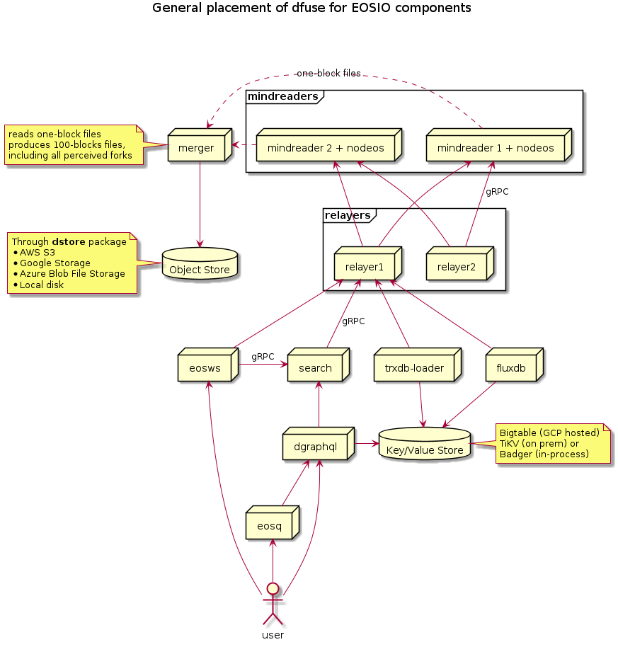
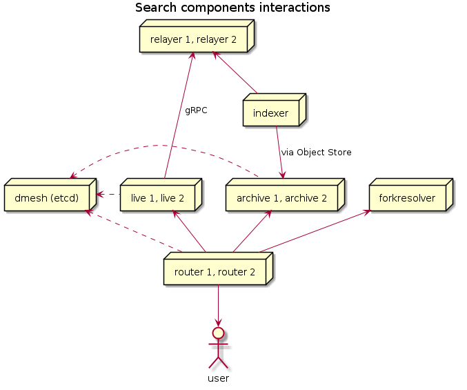

# dfuse for EOSIO Documentation

This is a (temporary?) place to store documentation about the
open-source `dfuse for EOSIO` software.

If you are looking for documentation on API usage, please see:
https://docs.dfuse.io

## Administration Guide

* Some partial sync instructions: ../PARTIAL_SYNC.md

## Architecture Diagrams

* []
* []
